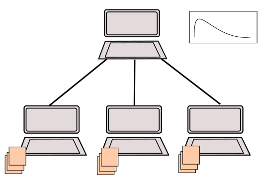

Année: 2021-2022
----------------

### Travaux pratiques 5

#### Objectifs

-   Comprendre la programmation client-serveur.

#### Exercice 5.1 [★]


Écrivez un programme en créant deux fichiers *repertoire.h* et
*repertoire.c* qui utilisent l'interface en ligne de commande et prennent
le nom du répertoire.

Ajoutez la déclaration suivante en repertoire.h
```
void lire_dossier(char *);             
```

Implémentez cette fonction en *repertoire.c* qui parcourt le répertoire
saisi par l'utilisateur et affiche les noms des fichiers (et
répertoires, si aucun) dans ce répertoire. Vous pouvez utiliser `opendir`,
`readdir` pour parcourir un répertoire.


#### Exercice 5.2 [★]


Ajoutez la déclaration suivante en *repertoire.h*

```
void lire_dossier_recursif(char *);             
```

Implémentez la fonction en *repertoire.c* qui parcourt le répertoire saisi
par l'utilisateur en récursif et affiche tous les noms des
fichiers, des répertoires, des sous-répertoires et des fichiers dans les
sous-répertoires. Pour mieux comprendre cette question, testez

```
$ ls -R              
```

sur la ligne de commande. Testez votre code. Utilisez le principe de la
fonction récursive.


#### Exercice 5.3 [★★]


Ajoutez la déclaration suivante en repertoire.h

```
void lire_dossier_iteratif(char *);              
```

Implémentez cette fonction en repertoire.c qui parcourt le répertoire
saisi par l'utilisateur en mode itératif et affiche tous les noms de
des fichiers, des répertoires, des sous-répertoires et des fichiers
dans les sous-répertoires. Mais cette fois, utilisez for (ou while ou
do..while) pour implémenter cette fonction. Testez votre code.


#### Exercice 5.4 [★★]

##### Client-Serveur

Un environnement client-serveur permet un mode de communication sur un
réseau entre les programmes. Un de ces programmes est appelé serveur qui
répond aux requêtes d'autres programmes appelés clients. Par exemple,

1.  Un client envoie un message au serveur et le serveur reçoit le
    message et le renvoie.
2.  Un client envoie l'opérateur et un/deux numéros et le serveur fait
    le calcul et envoie le résultat.

Référence : <https://fr.wikipedia.org/wiki/Client-serveur>



Pour simuler un environnement client-serveur, on va utiliser une seule
machine en lançant deux terminaux. Sur un des deux terminaux exécutez le
code du serveur. Sur l'autre, exécutez le code du client.

Téléchargez les fichiers suivants à partir d'e-campus : *client.h*,
*client.c*, *serveur.h*, *serveur.c*, *Makefile*. Lisez bien tous les fichiers.
Exécutez

```
$ make             
```

et voyez les fichiers exécutables qui sont créés.

Ouvrez deux terminaux. Sur le premier terminal, exécutez

```
./serveur             
```

et sur le second terminal

```
./client             
```

Entrez un message et voyez les affichages sur les deux terminaux.

Modifiez la fonction `recois_envoie_message` (*serveur.c*). Quand le
serveur reçoit un message, il demande à l'utilisateur de saisir un
message et envoie ce message au client. Testez votre code. N'oubliez pas
d'utiliser make (pour la compilation et la génération des fichiers
exécutables).


#### Exercice 5.5 [★★★]


Vous avez remarqué les premiers caractères dans chaque message :
'message' suivi par :. Pour votre prochaine question, on utilisera
calcule. 

Modifiez les fichiers client.c et serveur.c pour le support des
calculs simples (+,-,\*,...). Ajoutez une fonction
`envoie_operateur_numeros(...)` dans le fichier client.c et
`recois_numeros_calcule(...)` dans le fichier serveur.c. Le client
envoie l'opérateur et un (ou deux) numéros et le serveur envoie le
résultat. Par exemple, si le client envoie le message

```
calcule : + 23 45             
```

Le serveur répond

```
calcule : 68              
```

Testez votre code avec les numéros flottants et entiers.


#### Exercice 5.6 [★★★]


Pour votre dernière question, téléchargez le dossier etudiant. Dans ce
dossier, il y a 5 notes de 5 étudiants. Utilisez
envoie_operateur_numeros (voir 6) pour calculer la somme total des
notes de chaque étudiant ainsi que la moyenne de classe pour chaque
sujet.

Vous avez déjà implémenté la fonctionnalité permettant d'effectuer divers calculs comme l'addition,
la multiplication côté serveur, mais en utilisant 2 nombres à la fois.

Le but de l'exercice final est de calculer la somme de 5 notes et la moyenne pour chaque élève 
et pour la classe de 5 élèves (les détails sont stockés dans le répertoire). 

Vous devez assurer une série d'opérations côté client pour obtenir ces résultats

Par exemple, le client effectue une série d'appels suivants :
```
+ note1 note2
+ note3 note4
...
/ somme 5
```

Vous devrez modifier le serveur pour qu'il puisse lire et répondre aux messages du client dans une boucle infinie.  

Pour cet exercice, le serveur ne doit pas lire d'informations provenant des fichiers de l'élève. Le but du serveur est d'effectuer des calculs arithmétiques simples. Seul le client peut lire les fichiers relatifs aux notes des élèves et envoyer une série de messages au serveur pour obtenir la somme totale, la moyenne, etc. 


#### Fichiers

*client.c, client.h, Makefile, repertoire.c, repertoire.h, serveur.c,
serveur.h*

#### Instructions

-   N'oubliez pas les commentaires (nom de fichier, objectif, auteurs,
    , les lignes importantes de code etc.). Les commentaires sont notés.
-   N'oubliez pas de mettre à jour le fichier README.md et ajouter les
    détails concernant votre deuxième exercice.
-   Compte rendu en format .zip en un seul fichier.


