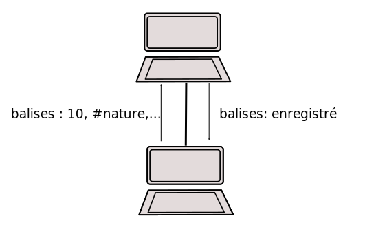

## Tâche 1.

Dans notre première tâche, votre mission consiste à envoyer différents types de messages.

1.  Le client envoie son nom et le serveur renvoie le même nom, en guise
    d\'accusé de réception.
2.  Un simple message envoyé par le client, auquel le serveur renvoie
    une réponse.
3.  Le client envoie deux numéros et un opérateur mathématique et le
    serveur répond le résultat de l\'opération.
4.  Le client envoie N couleurs et le serveur les enregistre dans un
    fichier.
5.  Le client envoie N balises et le serveur les enregistre dans un fichier.

### a. message

Pour simuler un environnement client-serveur, on va utiliser une seule
machine en lançant deux terminaux. Sur un des deux terminaux exécutez le
code du serveur. Sur l'autre, exécutez le code du client.

Téléchargez les fichiers suivants à partir d'e-campus : client.h,
client.c, serveur.h, serveur.c, Makefile. Lisez bien tous les fichiers.
Exécutez

`              $ make             `

et voyez les fichiers exécutables qui sont créés.

Ouvrez deux terminaux. Sur le premier terminal, exécutez

`              ./serveur             `

et sur le second terminal

`              ./client             `

Entrez un message et voyez les affichages sur les deux terminaux.

Modifiez la fonction recois\_envoie\_message (serveur.c). Quand le
serveur reçoit un message, il demande à l'utilisateur de saisir un
message et envoie ce message au client. Testez votre code. N'oubliez pas
d'utiliser make (pour la compilation et la génération des fichiers
exécutables).

### b. nom

Vous avez remarqué les premiers caractères dans chaque message
commencent par 'message' et suivi par :. Pour toutes les prochaines
missions, nous devons remplacer \"message\" par
\"nom\"/\"calcul\"/\"couleurs\". Votre prochain objectif est d\'écrire
une fonction envoie\_nom\_de\_client(\...) dans le fichier client.c
(C\'est à vous pour décider le nom) et une fonction renvoie\_nom(\...)
dans le fichier serveur.c qui renvoie le nom.

**Astuce** : Vous pouvez utiliser la fonction gethostname(...) (unistd.h) pour obtenir le nom de votre machine. Ne demandez pas le nom de votre machine à l'utilisateur.

### c. calcul

Votre prochaine mission consiste à effectuer des opérations
mathématiques côté serveur. Modifiez les fichiers client.c et serveur.c
pour prendre en charge des opérations mathématiques simples
(+,-,\*,\...). Ajoutez une fonction envoie\_operateur\_numeros(\...)
dans le fichier client.c et recois\_numeros\_calcule(\...) dans le
fichier serveur.c. Le client envoie l'opérateur et un (ou deux) numéros
et le serveur envoie le résultat. Par exemple, si le client envoie le
message.

`               calcule : + 23 45             `

Le serveur répond

`               calcule : 68              `

Testez votre code avec des nombres à virgule flottante et des entiers.

### d. couleurs

Votre prochaine mission dans cette tâche consiste à écrire une fonction
envoie\_couleurs(\...) dans le fichier client.c et une fonction
recois\_couleurs(\...) dans le fichier serveur.c. Le client envoie N
couleurs (N\<30) en utilisant le codage RGB
(<https://fr.wikipedia.org/wiki/Rouge_vert_bleu>) et le serveur reçois
ces couleurs et les enregistre dans un fichier.

par exemple, si le client veut envoyer 10 couleurs, il enverra le
message suivant

`              couleurs: 10, #0effeee,...             `

### e. balises

Votre dernière mission dans cette tâche consiste à écrire une fonction
envoie\_balises(\...) dans le fichier client.c et une fonction
recois\_balises(\...) dans le fichier serveur.c. Le client envoie N
balises (N\<30) et le serveur reçois
ces balises et les enregistre dans un fichier.

par exemple, si le client veut envoyer 10 balises, il enverra le
message suivant

`              couleurs: 10, #nature, #arbre,...             `

